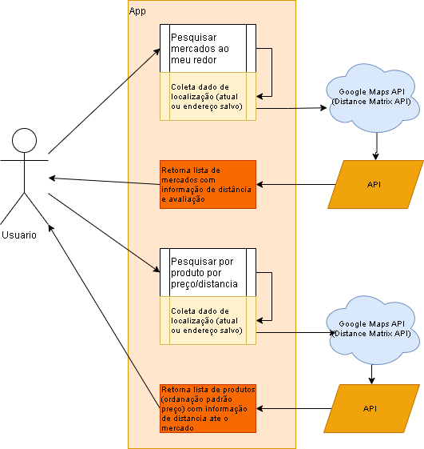

# Cesta web services

APIs Rest do aplicativo Cesta.
> **_Sobre:_** O Cesta tem como objetivo facilitar o acesso à informação para que consumidores e vendedores possam tomar as melhores decisões.

## APIs disponíveis
- [/mercados](#/mercados)
- [/produtos](#/produtos)

## Estrutura


## /mercados
API de informação sobre mercados para consumidores.

### [GET]
#### Requisição
```
Querystring: 
 - latitude : numérico
 - longitude: numério
```

#### Respostas
```
{
mercados: [ 
  {"nome": "MERCADINHO DA ESQUINA", "distancia": 0.2, "avaliacao": 5},
  {"nome": "MERCADINHO DO BAIRRO", "distancia": 1.5, "avaliacao": 4.5}
  ]
}
```

## /produtos
API de informação sobre produtos para consumidores.

### Requisição
```

```

### Respostas
```

```
